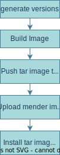

# yocto-images

Build definitions and scripts for Ci4Rail and EdgeFarm Images.

This repo can host several projects (with different Yocto versions, machines etc.).

Yocto builds are performed using [kas](https://github.com/siemens/kas).

## Images

The following images are currently built by this repo.

### base-image


An minimal image for the Ci4Rail Hardware including the follwing features:

- Docker
- Read Only Filesystem
- RW Data Partition

Target Platforms:

- Ci4Rail Moducop CPU01

### edgefarm-image


An image for the Ci4Rail EdgeFarm Services case including the following features:

- Docker
- Read Only Filesystem
- RW Data Partition
- Mender
- kubeedge

Target Platforms:

- Ci4Rail Moducop CPU01
- Raspberry Pi 4

### edgefarm-devtools-image


                
An image for the Ci4Rail EdgeFarm Services case including the following features:

- Docker
- Read Only Filesystem
- RW Data Partition
- Mender
- kubeedge
- development tools for edgefarm
- no login password

Target Platforms:

- Ci4Rail Moducop CPU01
- Raspberry Pi 4

### devtools-image


An image for HW platform tests and bringup including the following features:

- Read Only Filesystem
- RW Data Partition
- Mender
- Tools for HW testing
- no login password

Target Platforms:

- Ci4Rail Moducop CPU01

## Building

### Github Actions

Images are build automatically via github actions.

The following figure shows which steps are executed for corresponding image types:



### Local build with dobi

This section describes, how to build images locally using dobi.

First, enter credentials for mender and/or minio `config/secret.env` (using template `config/secret.env.template`).

Second, enter your specific data in `config/custom.env` (using template `config/custom.env.template`).
You can use the default setting, but MENDER_DEVICE_ID must be adapted to the device you want to use to [deploy locally built images via mender](#deploy-images-via-mender)
and TEST_COMPUTER_IP must be adapted to the test-computer ip address connected to the device you want to [deploy locally built images via minio](#deploy-images-via-minio):

```bash
MENDER_DEVICE_ID=<device id from mender portal>
TEST_COMPUTER_IP=<ip address of test-computer connected to the device to flash>
```

For example, to build the `edgefarm` image for `cpu01`:

```bash
./dobi.sh cpu01-edgefarm-build-image
```

To run an interactive yocto shell for `cpu01-edgefarm-image`:

```bash
./dobi.sh cpu01-edgefarm-yocto-shell
```

To build all images:

```bash
./dobi.sh all-build
```

## Install Images
### Deploy images via mender

Download [Mender CLI](https://docs.mender.io/downloads#mender-cli)

Login with `mender-cli login`.

Upload image to mender, e.g.:

```bash
./dobi.sh cpu01-edgefarm-mender-upload
```

To deploy an image to a specific device set the device ID you want to use for deployment, if you haven't specified it in `config/custom.env`:

```bash
MENDER_DEVICE_ID=<device id from mender portal>
```

Start deployment

```bash
./dobi.sh cpu01-edgefarm-mender-deploy
```

### Deploy images via minio

Upload image to minio, e.g.:

```bash
./dobi.sh cpu01-edgefarm-minio-push
```

To deploy an image to a specific device set the ip address of test-computer connected to this device, if you haven't specified it in `config/custom.env`:

```bash
TEST_COMPUTER_IP=<ip address of test-computer connected to the device to flash>
```

Start deployment

```bash
./dobi.sh cpu01-edgefarm-minio-deploy
```

### Install Raspberry Pi sdimg on SD Card

Find build images:

```
ls raspberrypi4-64-edgefarm*-image/install/images/raspberrypi4-64/EdgeFarm*-Image-raspberrypi4-64-*.sdimg
```

Install on SD Card (Linux):

```
sudo dd if=<PATH-TO-IMAGE>.sdimg of=<DEVICE> bs=1M && sudo sync
```

Or use [Raspberry Pi Imager](https://www.raspberrypi.org/downloads/):
- Click on `Select OS` and select `Own Image`
- Browse to build images directory and select the *.sdimg file
- Select SD Card to install on
- Press `write`